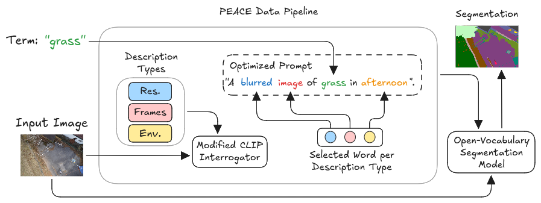

# PEACE :v:: Prompt Engineering Automation for CLIPSeg Enhancement in Aerial Safe-Landing Segmentation

PEACE enables the possibility of dynamically generating prompts that are specifically optimized for an input image. We believe that this is an important step towards developing more robust autonomous UAV systems. In summary, our main contributions are:
1) Dynamic aerial prompt engineering per image frame that can adapt to changing environments during safe-landing zone segmentation.

3) Introduce the method of combining positive and negative term segmentations to improve safe-landing zone segmentation accuracy: Generate segmentations for all safe-landing zones (positive terms: all target classes that are considered safe to land such as grass, park, water, etc.) and unsafe-landing zones (negative terms: all classes that are unsafe to land such as concrete, street, building, etc.). Segmentations of positive terms are stacked to merge safe-landing zone segmentations and the segmentations of negative terms are also stacked and merged to segment all unsafe-landing zones. Finally, the merged segmentations of negative terms are used to eliminate unsafe landing zones from the merged segmentations of positive terms.

## About

Comparison of CLIP and CLIPSeg’s original prompt engineering and PEACE using images from [CARLA](https://carla.org/).  

a) A photo of grass  
b) A photo of grass in animation play morning autumn  
c) A photo of grass  
d) A photo of grass in cartoon  

The **CLIP Interrogator** is a prompt engineering tool that combines OpenAI's [CLIP](https://openai.com/blog/clip/) and Salesforce's [BLIP](https://blog.salesforceairesearch.com/blip-bootstrapping-language-image-pretraining/) to optimize text prompts to match a given image. Use the resulting prompts with text-to-image models like [CLIPSeg](https://github.com/timojl/clipseg).
This work is an extenion of DOVESEI (https://arxiv.org/abs/2308.11471), where we improved on the prompt generation and engineering inside DOVESEI. The objective was to generate prompts that are dynamic, such that prompts are adaptive to observed images instead of a static prompt. In addition, they are automatically engineered to describe the observed images better.

Details about DOVESEI: https://github.com/MISTLab/DOVESEI/blob/main/README.md

## Publication
For more information about PEACE, refer to our paper: https://arxiv.org/abs/2310.00085
