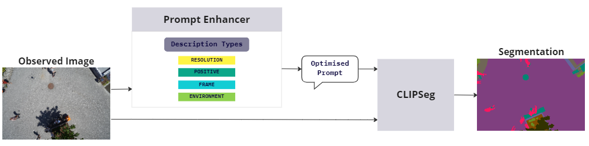
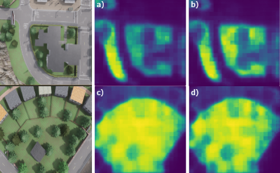

# PEACE :v:: Prompt Engineering Automation for CLIPSeg Enhancement
## CLIP Interrogator for Aerial Robotics

Built on top of CLIP Interrogator by [@pharmapsychotic](https://twitter.com/pharmapsychotic)

Generate prompts suited for aerial robotics (real and simlation) to be used for CLIPSeg.

## About

Comparison of CLIP and CLIPSeg’s original prompt engineering and PEACE using images from [Carla](https://carla.org/). 
a) A photo of grass 
b) A photo of grass in animation play morning autumn 
c) A photo of grass 
d) A photo of grass in cartoon

The **CLIP Interrogator** is a prompt engineering tool that combines OpenAI's [CLIP](https://openai.com/blog/clip/) and Salesforce's [BLIP](https://blog.salesforceairesearch.com/blip-bootstrapping-language-image-pretraining/) to optimize text prompts to match a given image. Use the resulting prompts with text-to-image models like [CLIPSeg]([https://github.com/CompVis/stable-diffusion](https://github.com/timojl/clipseg)).
This work is an extenion of DOVESEI (https://arxiv.org/abs/2308.11471), where we improved on the prompt generation and engineering inside DOVESEI. The objective was to generate prompts that are dynamic, such that prompts are adaptive to observed images instead of a static prompt. In addition, they are automatically engineered to describe the observed images better.

Details about DOVESEI: https://github.com/MISTLab/DOVESEI/blob/main/README.md

## Publication
For more information about PEACE, refer to our paper: https://arxiv.org/abs/2310.00085
